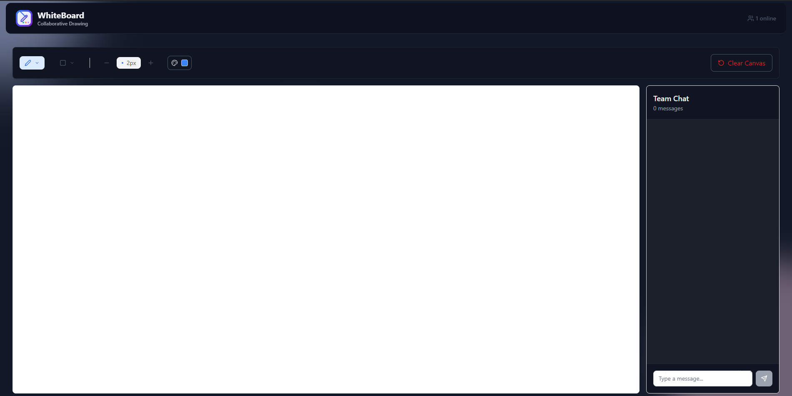

# Collaborative Canvas

**Real-time collaborative whiteboard app** built with React, TypeScript, Go, Redis, WebSockets, and Google Cloud Platform.  
Designed to enable seamless visual collaboration between multiple users — perfect for brainstorming, wireframing, or classroom use.

---

## Live Demo

 [Collaborative Canvas Demo](https://collaborative-canvas-25764.firebaseapp.com/)

---

##  Key Features

-  **Real-time collaboration** via native **WebSockets**
-  **Live presence tracking** with dynamic user count
-  **Interactive whiteboard** with drawing and color tools
-  **Persistent chat and canvas history** stored in **Redis**
-  **Automatic cleanup of Redis data** when all users disconnect
-  **Deployed on Firebase Hosting** with CI/CD via GitHub Actions
-  **Backend built in Go** — stateless WebSocket server deployed to **Google Cloud Run**

---

##  Tech Stack

| Frontend      | Backend             | Cloud / DevOps        |
|---------------|---------------------|-----------------------|
| React         | Go (Golang)         | Firebase Hosting      |
| TypeScript    | Gorilla WebSocket   | Google Cloud Run      |
| Vite          | REST/WebSocket APIs | GitHub Actions (CI/CD)|
| TailwindCSS   | Redis               | Docker                |

---

## Planned Improvements

- **Room-based sessions** with UUID for private collabrative canvas.
- **Role-based access control** as the host, guest, viewer-only, etc.
- **Exporting the canvas** as image or PDF.
- **More tools** including paint bucket, other types of brushes, and more.

---

## Contact

- GitHub: [User](https://github.com/QudahM)
- LinkedIn: [User](https://www.linkedin.com/in/qudahm/)
